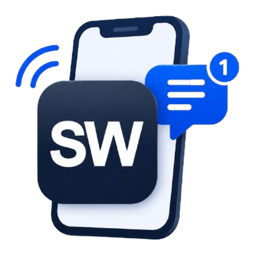

<!-- version 13 -->

<p align="center">
  
</p>

<h1 align="center">Notify Studio</h1>

<p align="center">
  Build, test, template, audit, and diagnose rich Home Assistant Companion notifications from one admin-only sidebar panel.
</p>

<p align="center">
  
  
  
</p>

> [!WARNING]
> Notify Studio is under active development. Review generated YAML before adding it to a live automation or script, and take a Home Assistant backup before installing an update.

> **v0.1.13** adds an in-panel **Logs** page for diagnostic activity and updates **Run test** so manual automation tests bypass top-level conditions. It also detects and explains single-mode runs that are already active.

## What it does

Notify Studio brings the fragmented parts of rich Companion notifications into one Home Assistant panel. It is built around legacy `notify.mobile_app_<device>` services, which retain the platform-specific Companion payload options that basic notify entities do not provide.

| Section | Purpose |
| --- | --- |
| **Notifications** | Audit notification calls found in merged YAML. Filter by source type, category, label, and notify device. Review matching runtime details and recent push activity. |
| **Compose** | Build a platform-aware notification, preview Jinja content live, send a test, save a template, and generate copy-ready YAML. |
| **Templates** | Create, edit, reuse, and delete saved notification drafts stored inside Home Assistant. |
| **Logs** | Review recent Notify Studio actions, warnings, and errors, including Run test outcomes. |

## Features

- Dynamic discovery of registered Home Assistant Companion mobile-app services.
- Android and Apple-specific composer options, shown only for the selected platform.
- Live Jinja preview for notification titles and messages.
- Safe test sends restricted to discovered Companion notifier services.
- Reusable templates with immediate loading from the Composer dropdown.
- Actionable-notification buttons for scripts, Home Assistant actions, URIs, text replies, and custom events.
- Generated YAML for the notification action and matching `mobile_app_notification_action` handlers where required.
- Merged-YAML auditing across automations, scripts, alerts, and nested action blocks.
- Notification filters for source type, category, label, and notify device.
- A separate recent-activity column for notification-related automations and scripts.
- Runtime enable/disable controls for matching automation entities and confirmed test runs for automations and scripts.
- In-memory operational logs for test sends, YAML generation, source scans, template changes, run-test requests, warnings, and backend errors.
- No browser-stored access token. The panel uses Home Assistant's authenticated WebSocket connection.

## Requirements

- Home Assistant **2026.5.0 or newer**
- HACS
- At least one Home Assistant Companion App mobile device for notification composition and test sends
- A Home Assistant administrator account

## Installation

### HACS custom repository

1. Open **HACS** in Home Assistant.
2. Open the three-dot menu and choose **Custom repositories**.
3. Add this repository URL:

   ```text
   https://github.com/pqpxo/ha-notify-studio
   ```

4. Select **Integration** as the category, then add the repository.
5. Search for **Notify Studio** in HACS and select **Download**.
6. Restart Home Assistant.
7. Go to **Settings** → **Devices & services** → **Add integration**.
8. Add **Notify Studio**, then open it from the Home Assistant sidebar.

### Manual installation

Copy the `custom_components/notify_studio` directory into your Home Assistant configuration directory:

```text
config/custom_components/notify_studio/
```

Restart Home Assistant, then add the integration through **Settings** → **Devices & services**.

## Using Notify Studio

### Compose a notification

1. Open **Compose**.
2. Select a Companion App target.
3. Enter the title, message, tag, image, URL, and any platform-specific values required.
4. Use **Send test** to validate and deliver the notification.
5. Use **Generate YAML** to create the notification action and any matching handler automation.

The right-hand panel shows a live rendered title/message preview and generated YAML.

### Save and reuse a template

1. Build a notification in **Compose**.
2. Select **Save Template**.
3. Give the template a name and optional description in **Templates**.
4. Return to Compose and choose the template from the **Template** dropdown. It loads immediately.

Templates are kept in Notify Studio's Home Assistant storage. They do not alter package YAML or existing automation files.

### Add actionable notification buttons

Enable **Actionable notification** in Compose and configure one or more buttons.

| Button type | Result |
| --- | --- |
| **Run script** | Generates a handler that calls the selected Home Assistant script. |
| **Run Home Assistant action** | Generates a handler that calls the chosen action with optional JSON data. |
| **Open URI / dashboard** | Opens a URI, deep link, or Lovelace route directly on the mobile device. |
| **Ask for text reply** | Generates a handler that exposes `trigger.event.data.reply_text`. |
| **Send event only** | Generates a safe starter handler for you to extend. |

Android supports up to three actionable notification buttons. Companion platform support and permissions still apply, so review generated YAML before production use.

### Audit notification sources

Open **Notifications** to scan merged Home Assistant YAML. The left column contains filters and all matching notification sources. The right column contains **Recently triggered push activity** for notification-related automations and scripts.

For matching runtime entities, an audit card can display:

- Last triggered time
- Category, labels, and discovered notify devices
- Enable/disable control for automations
- A confirmed **Run test** action
- A confirmed editor shortcut for the matching automation or script

> [!NOTE]
> The static audit covers merged YAML configuration, including packages and supported include files. Sources created only outside YAML may not be returned by the scanner.

### Diagnose Run test problems

Open **Logs** after using a Run test button. Notify Studio records whether Home Assistant accepted, blocked, or rejected the request.

- **Automation disabled**: enable the automation first.
- **Already running in single mode**: wait for the current run to finish before running another test.
- **Run test queued**: Home Assistant accepted the request. For automations, top-level conditions are deliberately bypassed so notification actions can be tested reliably.
- **Service/action error after queueing**: inspect the automation trace or the Home Assistant system logs, as the app can confirm the request was queued but cannot safely wait for long-running automations to finish.

The Logs page keeps the latest 250 application events in memory and clears when Home Assistant restarts. It does not copy the entire Home Assistant system log and it does not record notification payload contents.

## Platform notes

### Android

Notify Studio exposes Android-compatible options including channel, importance, priority, colour, icon, timeout, sticky behaviour, persistent notifications, and Android URI actions.

Persistent notifications require a `tag`. Notify Studio supplies an editable tag automatically when Persistent notification is enabled and the Tag field is empty.

### Apple devices

Apple-specific options include subtitle, sound, badge, interruption level, and thread ID. Critical and time-sensitive notification behaviour depends on Companion App permissions and device settings.

## Security and safety

- All Notify Studio WebSocket commands require an administrator account.
- Test sends and run-test controls can trigger real notifications, automations, scripts, and device actions.
- Test sends are restricted to discovered `notify.mobile_app_*` services.
- Run test deliberately bypasses **top-level automation conditions**. It does not alter the automation configuration.
- Review all generated YAML, especially actionable-notification handlers that call scripts or Home Assistant actions.

## Development

```text
notify-studio/
├── custom_components/notify_studio/
│   ├── brand/                 # Integration and README logo assets
│   ├── frontend/              # Compiled panel bundle committed for HACS
│   ├── log_store.py           # Bounded in-memory application log
│   ├── notification_schema.py # Payload validation and YAML generation
│   ├── notify_scanner.py      # Merged-YAML notification scanner
│   ├── template_store.py      # Saved notification template storage
│   └── websocket_api.py       # Admin-only panel API
├── panel-src/                 # React, TypeScript, and Vite source
└── .github/workflows/         # HACS and Hassfest validation
```

### Build the panel

```bash
cd panel-src
npm install
npm run typecheck
npm run build
```

The compiled module is written to:

```text
custom_components/notify_studio/frontend/notify-studio-panel.js
```

Commit that built bundle with every frontend source change, as HACS users do not run a build step.

## Versioning and HACS releases

Use GitHub branches and pull requests for changes. After merging a version into `main`, publish a GitHub Release such as `v0.1.13`. HACS uses published releases to offer version selection and rollback.

See [HACS_RELEASE_WORKFLOW.md](HACS_RELEASE_WORKFLOW.md) for the release checklist.

## Support

Open an issue at [pqpxo/ha-notify-studio](https://github.com/pqpxo/ha-notify-studio/issues) with your Home Assistant version, Notify Studio version, browser console errors, and any relevant sanitized log entries from the **Logs** page.
